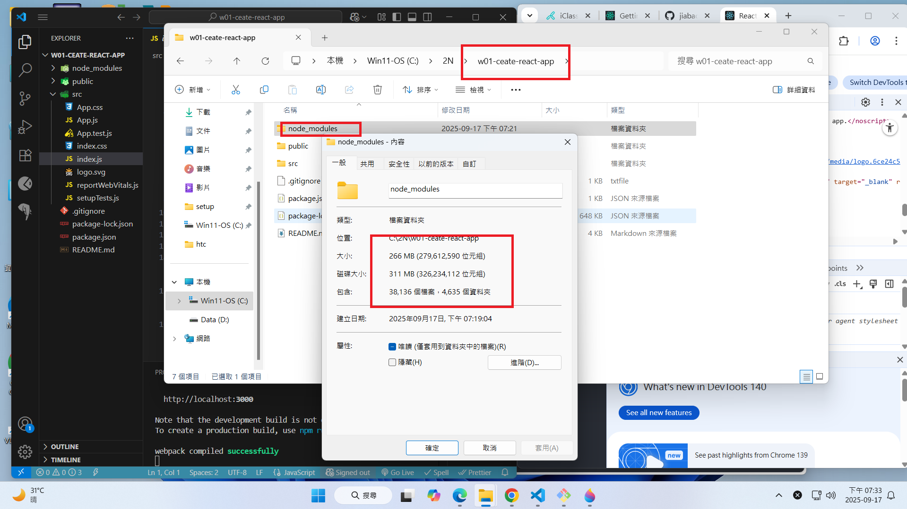
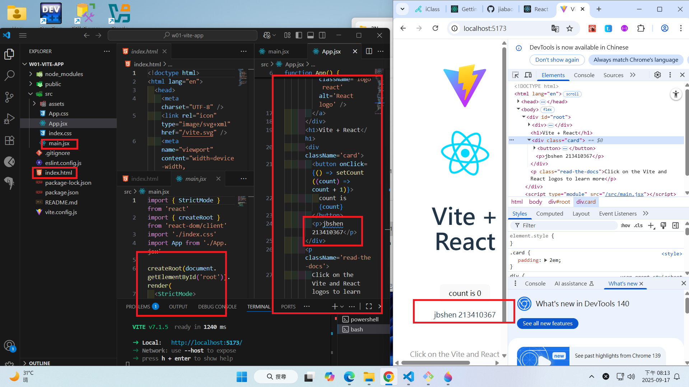
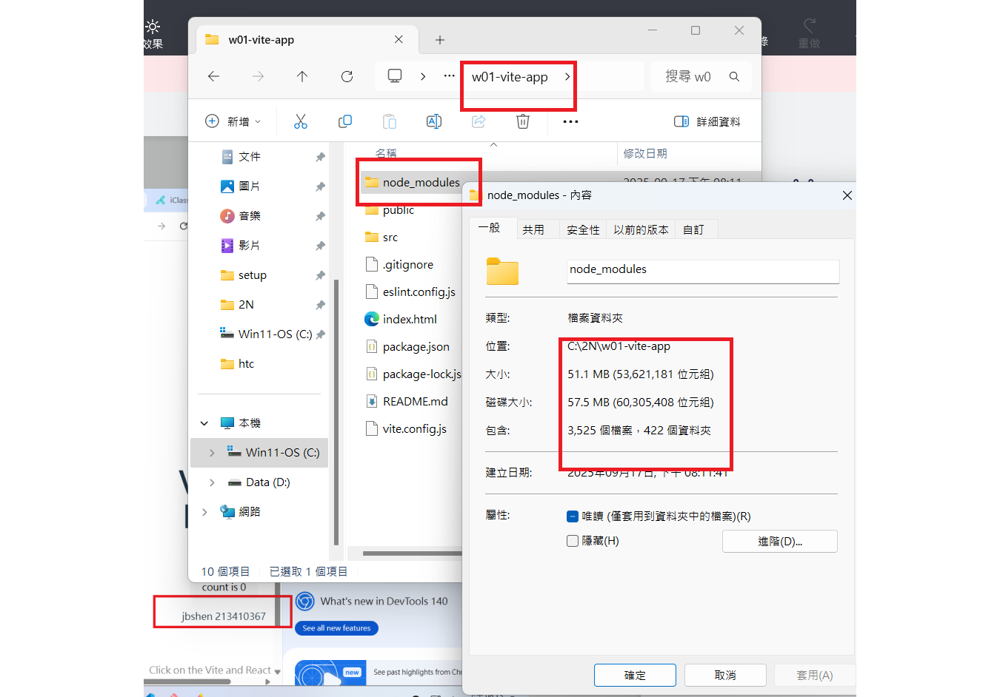

[Github URL](https://github.com/jiabao721/1132-2N-demo-jbshen-67)

### W01-P1: Use create-react-app to create a new React app

#### => show how the index.html page being rendered


#### => share the size of node module



```
dc5b08a jiabao721       Wed Sep 17 20:00:05 2025 +0800  W01-P1: Use create-react-app to create a new React app
```

### W01-P2: Use vite to create a new React app

#### => show how the index.html page being rendered



#### => share the size of node module



```

```
