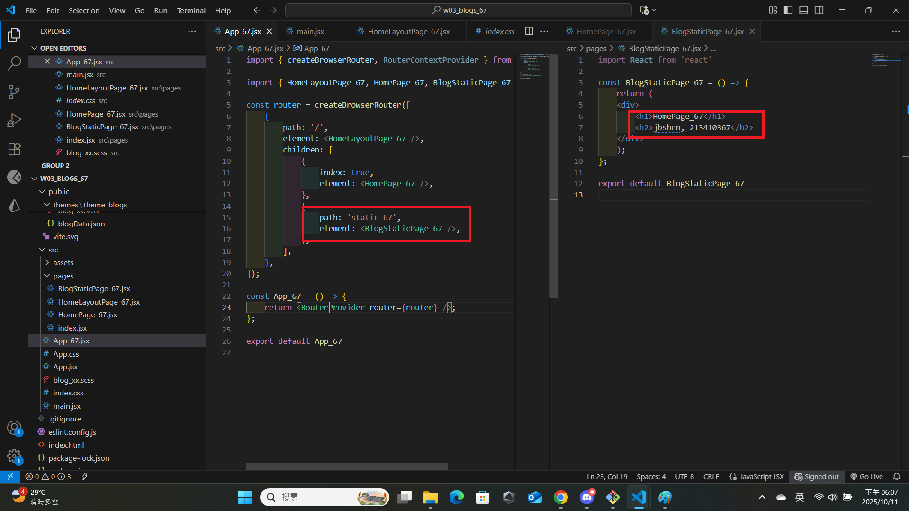
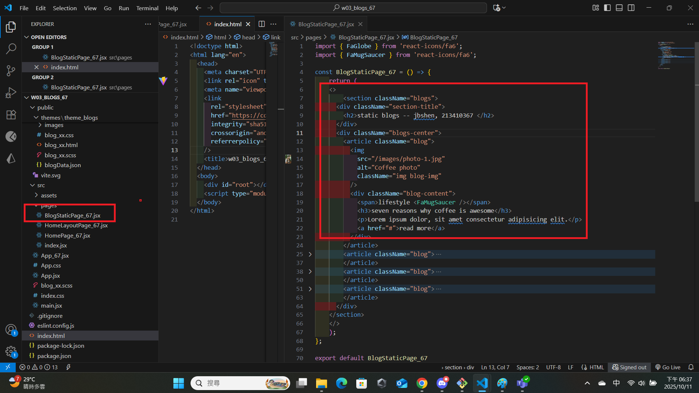
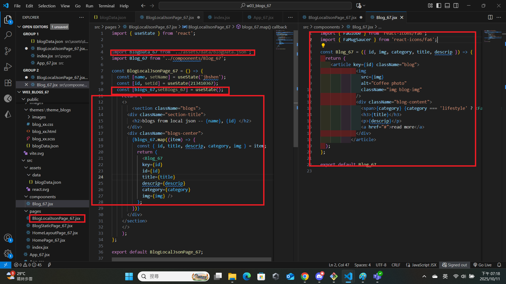

[Github URL](https://github.com/jiabao721/1132-2N-demo-jbshen-67)

### W03-P1: Create router in App_xx.jsx
 
#### => route / for HomePage_xx
 

 
#### => route /static_xx for BlogStaticPage_xx
 

 
```
6b97daa jiabao721       Sat Oct 11 18:14:21 2025 +0800  W03-P1: Create router in App_xx.jsx
```

### W03-P2: Implement route /static_xx for BlogStaticPage_xx
 

 
```
db06154 jiabao721       Sat Oct 11 18:38:35 2025 +0800  W03-P2: Implement route /static_xx for BlogStaticPage_xx
```

### W03-P3: Implement route /localjson_xx by showing blogs from local json
 
#### => Chrome demo using React DevTools
 

 
#### => code for BlogLocalJson_xx
 

 
```
79d4539 jiabao721       Sat Oct 11 19:20:54 2025 +0800  W03-P3: Implement route /localjson_xx by showing blogs from local json
```
 