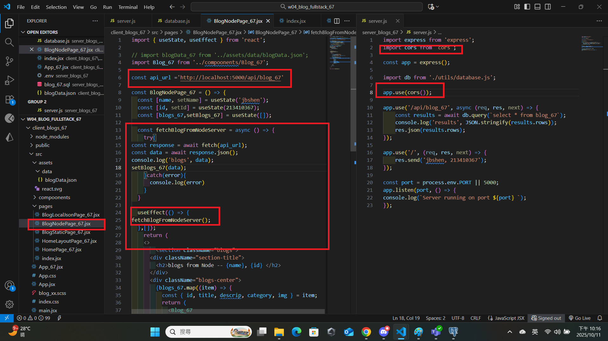

[Github URL](https://github.com/jiabao721/1132-2N-demo-jbshen-67)

###　W04-P1: Create a express Web server to show your info
 

 
```
097ccc1 jiabao721       Sat Oct 11 20:12:43 2025 +0800  W04-P1: Create a express Web server to show your info
```

###　W04-P2: Create blog_xx table with 3 data, implement route /api/blog_xx to return a json array with 3 data
 
#### => SQL to create blog_xx table and 3 data
 

 
#### => show 3 data
 

 
#### => implement route /api/blog_xx
 

 
```
d7b859b jiabao721       Sat Oct 11 21:33:05 2025 +0800  W04-P2: Create blog_xx table with 3 data, implement route /api/blog_xx to return a json array with 3 data
```

### W04-P3: from client side to get json data from Node
 
#### => modified client and server code
 

 
#### => Chrome, show 3 blogs
 

 
```
da4eef9 jiabao721       Sat Oct 11 22:18:19 2025 +0800  W04-P3: from client side to get json data from Node
```