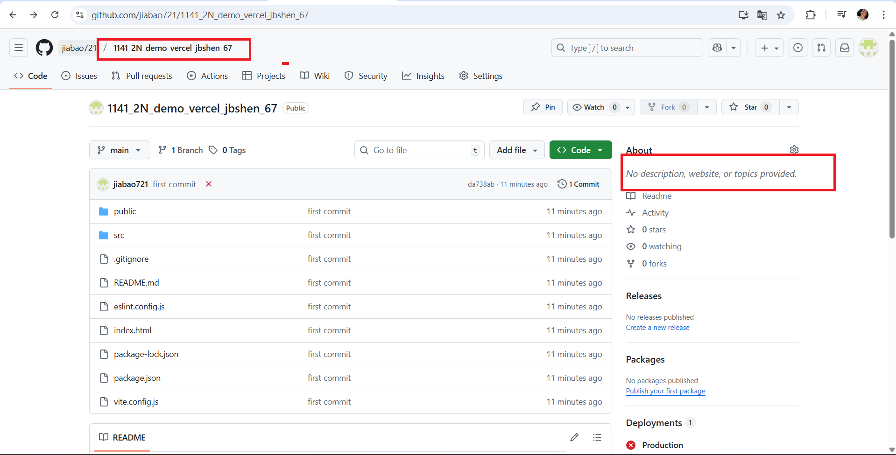

[Github URL](https://github.com/jiabao721/1132-2N-demo-jbshen-67)

### W05-P1: Create Navbar_xx using styled components, and show BlogNodePage_xx
 
##### => Chrome
 

 
##### => relevant code
 

 
```
c0071d3 jiabao721       Thu Oct 16 20:01:15 2025 +0800  W05-P1: Create Navbar_xx using styled components, and show BlogNodePage_xx
```

### W05-P2: Deploy the code to Vercel
 
#### => Show BlogLocalJson in Vercel
 

 
#### => Github repo with Vercel link
 

 
#### => Github demo_vecel repo and Vercel URL
 
[Github URL for Vercel](https://github.com/jiabao721/1141_2N_demo_vercel_jbshen_67)
[Vercel URL]()
 
```
9527456 htchung Wed Oct 15 19:51:18 2025 +0800  W05-P2: Deploy the code to Vercel
```